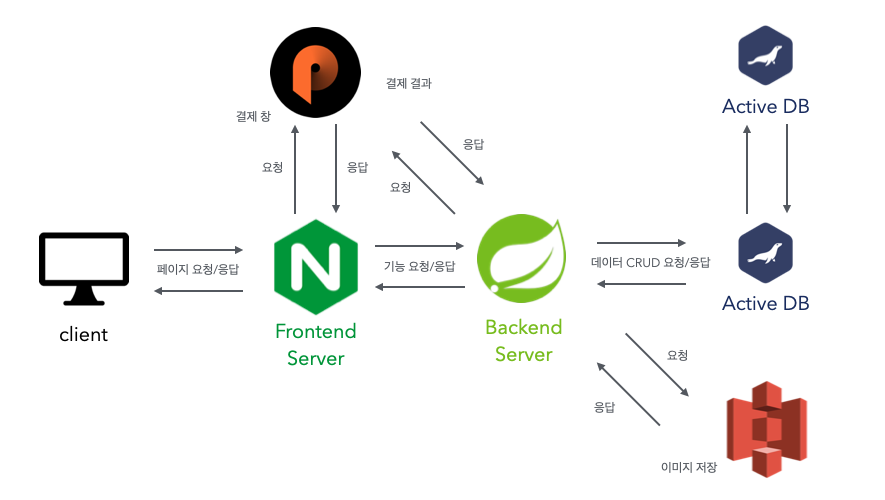

<h1 align="center">GreenPlate</h1>

> [플레이 데이터] 한화시스템 BEYOND SW캠프  
> 6기 2차 프로젝트 **팀 404x**
## 🤚 404x 팀원
<table>
 <tr>
    <td align="center"><a href="https://github.com/ohgyulim"></td>
    <td align="center"><a href="https://github.com/dyun23"></td>
    <td align="center"><a href="https://github.com/lrkdms125"></td>
    <td align="center"><a href="https://github.com/winter0123"></td>
  </tr>
  <tr>
    <td align="center"><i>Team Leader</i> <a href="https://github.com/ohgyulim"><b>오규림</b></td>
    <td align="center"><a href="https://github.com/dyun23"><b>김다윤</b></td>
    <td align="center"><a href="https://github.com/dlrkdms125"><b>이가은</b></td>
    <td align="center"><a href="https://github.com/winter0123"><b>장유정</b></td>
  </tr>
  </table>

## 📌 프로젝트 주제 

   

 

### 건강한 삶을 위한 나만의 식재료 추천 사이트 
레시피를 추천해주고, 레시피 속 필요한 재료를 한 번에 담을 수 있는 기능을 제공

레시피에 사용된 재료 각각의 칼로리를 보여주고, 장바구니에 상품을 담았을 때 장바구니에 담긴 전체 상품의 칼로리 합계를 보여주는 기능 

라이브 스트리밍과 커머스의 합성어인 라이브커머스 서비스 제공  
[추가 자료](https://github.com/beyond-sw-camp/be06-1st-404x-GreenPlate/wiki/%ED%94%84%EB%A1%9C%EC%A0%9D%ED%8A%B8-%EA%B0%9C%EC%9A%94)

## 🔧 기술 스택
백엔드  
   
DB  
   
클라우드  
  
협업 툴  
    

## 📄 API 명세서
- [Swagger-Ui]()

## 📊 시퀀스 다이어그램
- <a href="https://github.com/beyond-sw-camp/be06-2nd-404x-GreenPlate/wiki/시퀀스-다이어그램">시퀀스 다이어그램 위키</a>

## ✨ 기능 테스트

 User 

### 회원가입

### 로그인

### 배송지 등록

### 마이페이지

 Item 

### 사업자 상품 등록

### 유저 상품 목록 조회

 Cart 

### 장바구니에 등록

### 장바구니 조회

 Order 

### 결제

### 주문 저장

 Recipe 

### 레시피 등록

### 레시피 목록

## 🖥️ 시스템 아키텍처

DB

- 이커머스의 빠른 응답속도는 긍정적인 사용자 경험을 제공할 수 있다고 생각했고, 빠른 응답속도를 위한 부하 분산이 가능하도록 Active - Active 구성을 하였습니다.
- 또한 Active - Active 구성으로 **두 서버는 항상 동일한 데이터를 유지하기** 때문에 에러가 발생했을 시 빠르게 대처할 수 있습니다.

 Amazon S3 

- 상품의 썸네일, 상세 이미지 등 상품과 관련된 이미지를 저장하기 위해 S3를 사용하였습니다.

 Backend Server 

- 레시피 *전시/등록/좋아요/리뷰*, 상품 *전시/구매/등록/좋아요/리뷰*, 라이브커머스 등 저희가 제공하고자 하는 서비스는 매우 많습니다. 모놀리식으로 서버를 구성하여 빠르게 개발을 끝내고 추후 부하가 발생하면 부하가 발생하는 기능 별로 서버를 분리하고자 합니다.

 Frontend Server 

- 외부 API의 웹 페이지를 요청하기 위해 사용했습니다.

 PortOne 

- 상품 결제를 위해 PG사의 결제 대행 서비스 중 하나인 PortOne을 사용하였습니다.

## 👩‍💻 소프트웨어 아키텍처
- <a href="https://github.com/beyond-sw-camp/be06-2nd-404x-GreenPlate/wiki/소프트웨어-아키텍처">소프트웨어 아키텍처 위키</a>

## ⌨️  코드 컨벤션
- <a href="https://github.com/beyond-sw-camp/be06-2nd-404x-GreenPlate/wiki/코드-컨벤션">코드 컨벤션 위키</a>

## ✍️ 성능 개선
- <a href="https://github.com/beyond-sw-camp/be06-2nd-404x-GreenPlate/wiki/성능-개선">성능 개선 위키</a>